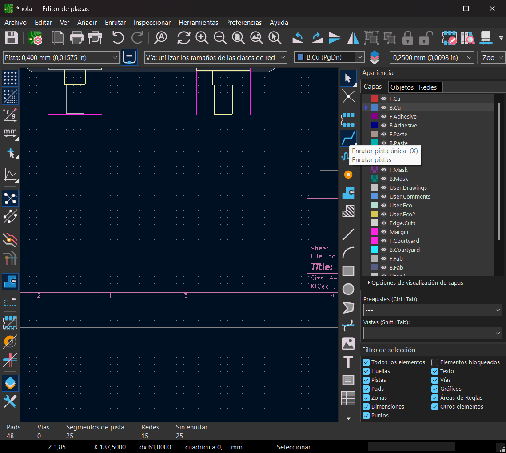

# sesion-09a

# Apuntes clase 12/05

Ésta clase tuvo que ser mediante zoom debido a un incendio en república, lo cual hace un poco más difícil el trabajo ya que estamos usando el computador para trabajar y para ver la clase al mismo tiempo, lo cual es un poco confuso y nos puede distraer.

### Repaso rápido de KiCad

Para iniciar la materia nos hicieron un repaso rápido de cómo se utiliza KiCad, lo cual agradezco bastante ya que se me habían olvidado las siguientes cosas:

+ Para modificar el tamaño de la lámina en la cual estamos trabajando tenemos que hacer doble click dentro de la viñeta que se encuentra en la esquina abajo a la derecha.
+ Con click derecho se puede eliminar la asignación de una huella dentro del panel de asignación de huellas.
+ Para asignar huellas de manera más directa, selecciona el símbolo y presiona la tecla ``F`` de _footprint_ (huella)
+ ``Alt + 3`` para entrar al visor 3D

### Capas de cobre

``F.Cu`` y ``B.Cu`` son las capas en donde se encuentran las pistas de cobre, las cuales son el equivalente a los cables dentro de nuestra protoboard en donde una trabaja por el lado frontal (``F.Cu``) y la otra trabaja por el lado de atrás (``B.Cu``). Podemos tener distintos anchos en las pistas, los cuales tienen que ser mínimo de 0.3 mm.

Para poder añadir y editar grosores tenemos que hacerlo en la esquina superior izquierda donde se menciona la "Pista", luego de hacer click nos aparecerá la opción de "Editar tamaños predefinidos..." que es en donde podremos añadir y editar grosores para las pistas.

Cuando hagamos click en la opción que se muestra en la imagen anterior, nos aparecerá que estamos en la sección de ``Reglas de diseño -> Tamaños predefinidos``. Ya estando en éste lugar, tenemos que presionar el símbolo ``+`` que se encuentra en la sección inferior de ``Pistas`` como se muestra en la siguiente imagen:

Cuando presionamos el símbolo ``+`` ya podremos agregar los tamaños que queremos, que en nuestro caso fue de 0.4mm y 0.8mm.

Como ya tenemos los grosores deseados, podemos empezar a crear las pistas ubicándonos en la capa correspondiente (``F.Cu`` o ``B.Cu``) y seleccionando la herramienta de ``Enrutar Pista Única`` o apretando la tecla ``X``.

-------------------------

zonas rellenas en donde ponemos toda la placa

propiedades de la zona de cobre y decir que voy a rellenar arriba y abajo con red GND, lo cual hará que todos sean el gnd de todos 
para cerrar el paso hay que utilizar la letra ``B``, lo cual rellenará todos los espacios de la placa en gnd

red es sinónimo de cable
Vías ``V``

Para poder montar nuestra PCB a nuestra carcasa, tenemos que hacerle hoyos para poder poner separadores o pernos (los pernos son la opción más barata), por lo que Misa nos recomienda su tamaño predeterminado que es para el perno M3. Para poder añadir los espacios para los pernos, hay que buscar en símbolos la opción de ``Mounting Hole``, en donde 
mounting hole m3 huella mounting hole 3.2mm (m3)

archivo importar rggaficos dxf
